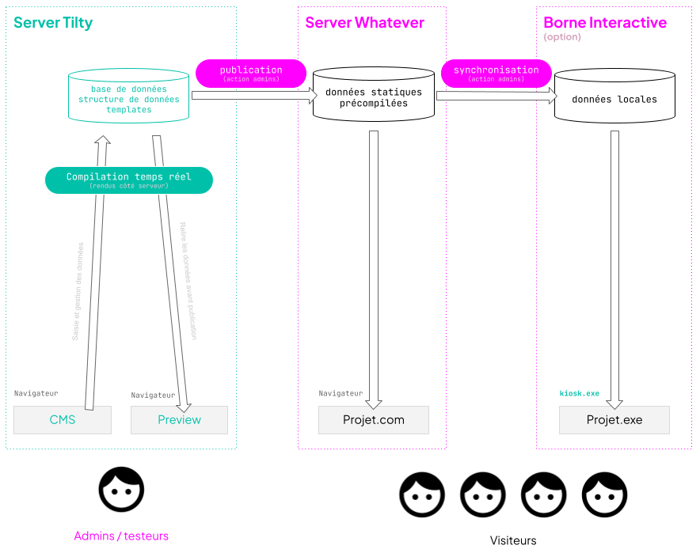
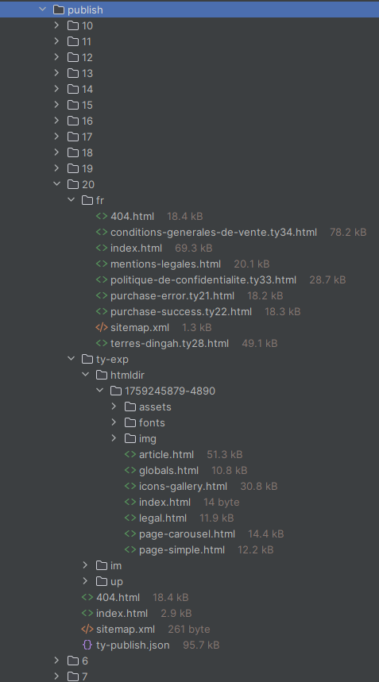

> **Version** : 0.11.5

# Gestion des urls et SEO (finir de rédiger)

# Différents types d'url

Les urls de votre projet sont optimisées pour le référencement naturel et correspondent à une logique qui permet de relier une url à une page de votre site.

## Comprendre les urls Tilty

## `https://nom.de-domaine.com/sous/repertoire/slug`

## `protocole` `nom de domaine ou sous domaine` `sous répertoire` `slug`

### structure

#### Le projet et la langue

Un projet dans une langue donnée peut être déterminé par le nom de domaine seul ou un couple domaine \+ sous répertoire.  
Un même projet en français pourrait être déterminé par les urls suivantes:

| `https://monsite.fr` | domaine  seul |
| :---- | :---- |
| `https://fr.monsite.com` | sous domaine  seul |
| `https://monsite.com/fr` | domaine \+ sous répertoire |
| `https://www.monsite.com/fr` | sous domaine \+ sous répertoire |
| `https://`xxxx.tilty.io/`monsite/fr` | sous domaine tilty \+ répertoire \+ répertoire de langue |

Il est à noter qu'un même domaine peut être utilisé pour plusieurs projets

#### La langue

La langue d'une page peut être déterminée par le nom de domaine, le sous sous domaine, ou encore le premier répertoire juste après le nom de domaine.

#### slug

#### id

## Les urls avec `tyid`

## `https://projet.com/fr/ma-super/page/qui-a-un-id.ty99`

La plupart des urls de votre projet comprend un identifiant qui ressemble à `tyxx`. où **xx** correspond à l'identifiant de l'url.  
Le reste de l'url  que l'on appellera slug ne permet pas de rechercher la page mais sert à lui donner une url qui corrèle avec son contenu. C'est la partie de l'url que les moteurs de recherche ou les utilisateurs vont plébisciter. 

### Redirections 301 automatique vers la meilleure url

Prenons l'exemple d'une page donnée dont l'url serait…  
`https://projet.com/fr/tomate.ty99`  
Si jamais un site fait un lien vers cette page mais que le webmaster a fait une faute d'orthographe en copiant l'URL…  
`https://projet.com/fr/tumate.ty99`

Pas de panique, la page fonctionnera toujours grâce au **`ty99`**. L'utilisateur qui ira sur une telle url sera redirigé (redirection 301\) vers la bonne url automatiquement.

En réalité, même une url totalement farfelue comme…  
`https://projet.com/fr/url-totalement/farfelue-tralala.ty99`  
redirigera toujours vers l'url correcte, à savoir…  
[`https://projet.com/fr/tomate.ty99`](https://projet.com/fr/tomate.ty99)**

# Gestion SEO

## Search engine optimization

# Sitemap.xml

Le sitemap XML liste toutes vos urls qui doivent être indexées.  
Votre sitemap est accessible simplement via des urls comme suit…

| `https://`xxxx.tilty.io/`monsite/sitemap.xml` | sous domaine tilty \+ répertoire de projet.   Il s'agit d'un sitemap index car aucune langue n'est spécifiée |
| :---- | :---- |
| `https://`xxxx.tilty.io/`monsite/fr/sitemap.xml` | sous domaine tilty \+ répertoire \+ répertoire de langue Il s'agit d'un urlset car une langue est définie |

Selon si l'url est localisée ou non, le sitemap sera un **site map index vers les sites map localisés** ou un **listing des pages dans une locale donnée**.

# Publications

Tilty est conçu pour générer des **sites statiques**, c’est-à-dire des versions de vos projets prêtes à l’emploi, fonctionnant directement dans un navigateur **sans base de données** ni **langage serveur**.

## Dormez tranquille

Une fois exporté, votre site se résume à des fichiers HTML, CSS et JS pouvant être servis par n’importe quel hébergeur ou CDN, sans dépendre d’une base de données ou d’un runtime serveur. Cela **réduit fortement les risques de panne liés aux surcharges**, aux erreurs de configuration ou aux indisponibilités de services dynamiques côté hébergeur. En complément, l’absence de code serveur diminue aussi la surface d’attaque, ce qui **contribue à la stabilité et à la sécurité** globale du site.

## Plusieurs serveurs de publication ?

Vous pouvez publier votre projet sur plusieurs serveurs distincts.
Voici une configuration courante d'un projet  avec 3 serveurs de publications

**Pré-production**
**`https://`**`preprod.mon-site.com`
Serveur dédié à la relecture et aux tests avant publication en **Production**.

**Production**
**`https://`**`mon-site.com`
Serveur du site web public.

**Bornes interactives**
**`tilty-kiosk.exe`**
Publication du projet sur les bornes interactives dans le hall d'accueil de votre entreprise :)

# Configuration des serveurs de publication

## Les différents types de serveurs de publication

Tilty vous offre la possibilité de publier votre site sur différents environnements.

- Hébergement Tilty
- Hébergement externe, avec prise en charge de php
- Hébergement externe, sans prise en charge de php
- Exécutable Tilty kiosk (hébergement Tilty)

|  | transfert automatique | téléchargement zip |
| :---- | :---- | :---- |
| hébergement tilty | OK TODO | TODO |
|  hébergement externe, avec php | OK  | TODO |
| hébergement externe, sans php | NOK | TODO |
| exécutable Tilty kiosk | OK MAJ | TODO |

Nous vous conseillons d'héberger vos publications sur les serveurs Tilty, ainsi vous ne vous occupez de rien et tout fonctionne sans configuration.

Toutefois nous sommes conscients que pour des raisons, techniques,  juridiques ou administratives vous deviez héberger votre site sur un serveur totalement indépendant de nos services.

### Le choix des fichiers de configuration

Ce chapitre ne vous concerne pas si vous utilisez un serveur Tilty.

#### .htaccess

Un fichier .htaccess permet d'indiquer aux serveurs apache (la plupart des hébergements grand public) comment *servir* votre site web.

##### Problèmes courants  (et fréquents)

* Il est possible que votre hébergeur ne vous permette pas d'uploader un fichier .htaccess via Tilty.
* Il est possible que votre hébergeur ne vous permette pas d'utiliser les fichiers .htaccess
* Il est possible que votre hébergeur ne comprenne pas les fichier .htaccess

Dans tous ces cas, n'insistez-pas, configurez manuellement votre hébergement.

##### .htaccess=common

Si vous choisissez "**common**", alors un fichier .htaccess standard sera uploadé sur votre serveur.
Ce fichier est issu de [https://github.com/h5bp/server-configs-apache](https://github.com/h5bp/server-configs-apache). Sans rentrer dans le détail, il…

* Définit une page 404 personnalisée (/404.html) et désactive MultiViews pour éviter des 404 bizarres.
* Gère les CORS pour les images et les polices (autorise leur chargement depuis n’importe quel domaine).
* Déclare proprement les types MIME et force l’encodage UTF-8 pour HTML, CSS, JS, JSON, etc.
* Améliore la sécurité de base : pas de listing de répertoires, blocage des fichiers cachés / de backup, suppression du header X-Powered-By, ServerSignature Off, X-Content-Type-Options: nosniff.
* Optimise les perfs : compression gzip (mod\_deflate), suppression des ETags et mise en cache longue durée (mod\_expires) pour les assets statiques.

#### index {#index}

L'index se charge principalement de **rediriger l'internaute vers la bonne langue** quand il saisit le nom de domaine sans indication de langue.
Par exemple, le visiteur qui saisit [https://mon-site.com](https://mon-site.com) pourra être redirigé vers [https://mon-site.com/fr](https://mon-site.com/fr) ou vers [https://mon-site.com/en](https://mon-site.com/en) selon ses préférences linguistiques.

##### index.locales.html

Si vous choisissez cette option, un fichier `index.html` sera généré en fonction des préférences linguistiques de votre projet.
Cette page html n'est pas censée être consultée, il s'agit simplement d'une page de redirection.

Afin de déterminer quelle langue utiliser le programme fonctionne dans cet ordre:

* Recherche si l'utilisateur a précédemment choisi une langue en cliquant sur le menu de langue par exemple.
  (recherche dans le localstorage la variable "`chosen-lang`")
* Recherche si le navigateur a une langue préférée qui figure dans la liste des langues gérée par le site.
* En dernier recours, choisit la langue par défaut.

# Quand utiliser un export ?

* Lors de la **mise en ligne** d’un projet ou lors d'une modification de contenu

* Pour **publier une mise à jour** dans une version exécutable (ex. [Tilty kiosk]())

* Pour **archiver** un état du projet

* Pour **déployer** le site sur un **autre serveur** que ceux de Tilty

# Pourquoi un export statique ?

## Performance

Un site statique n’interroge pas de base de données et n’exécute aucun script serveur : tout est **pré-généré**. Résultat ? Le chargement des pages est **quasi instantané**. Là où un CMS comme WordPress peut mettre plusieurs secondes à générer une page, un site statique la sert en **zéro seconde** — puisque la page a déjà été calculée au moment de l’export.

## Sobriété numérique

Au-delà de la performance, le choix d’un site statique s’inscrit dans une **démarche éco-responsable**. En supprimant les appels à des bases de données et l’exécution de scripts côté serveur, les exports générés par Tilty consomment **nettement moins de ressources**. Chaque page est servie telle quelle, sans calcul à la volée, ce qui **réduit la charge sur les serveurs**, la **consommation énergétique** et, par extension, l’**empreinte carbone** de votre projet. Un site statique peut ainsi être hébergé sur des infrastructures plus légères, voire mutualisées, tout en restant rapide et fiable.

**Cependant**, il est important de rappeler que **la conception du front-end reste entre les mains du webdesigner**. Le poids des fichiers HTML, CSS, JavaScript, des polices et des médias a un **impact direct** sur la performance et l’impact environnemental global. Bien que Tilty intègre un **système de cache intelligent** pour limiter les appels et optimiser les chargements, celui-ci **ne peut compenser un front mal conçu**. Une démarche sobre et responsable doit donc se prolonger jusqu’au design : images optimisées, code allégé, polices limitées, chargement différé des scripts… chaque détail compte. Tilty vous donne les outils pour aller loin, mais c’est la qualité du travail de conception qui en détermine l’efficacité réelle.

## Mode édition vs. mise en ligne

Grâce au système de publication, Tilty vous permet de **dissocier totalement le travail en cours d'édition** de la version publiée. Les modifications que vous apportez dans l’éditeur — qu’il s’agisse de contenus, de structures ou de médias — restent cantonnées aux éditeurs tant qu’aucune publication n’a été réalisée. Cela signifie que vous pouvez tester, ajuster, expérimenter sans craindre d’impacter la version en ligne. Ce n’est qu’au moment de l’export que vos changements sont figés et mis à disposition du public. Cette séparation nette entre édition et publication apporte une **grande sérénité** dans le processus de création, rédaction et publication.

# Le processus de publication en détail

*Quand vous appuyez sur le bouton d'un serveur de publication, que se passe-t-il ?*

La publication peut prendre plusieurs minutes, ce qui suit vous explique ce qui se passe étape par étape.

* création d'un répertoire où on va tout stocker
* création d'un fichier json de log de l'export
* génération des pages html \+ localisations
* génération des sitemap.xml \+ localisations
* génération des fichiers optionnels tels que index.html ou encore .htaccess
* copie des médias.
* copie des médias optimisés (images webp etc)

à ce stade tout est prêt, le transfert des fichiers vers le serveur de publication va commencer.

* upload des fichiers un à un dans une répertoire temporaire
* copie des fichiers du répertoire temporaire vers les bon emplacements avec écrasement des fichiers si nécessaire.
* vous noterez donc que l'on ne supprime pas les fichiers du serveur, on se contente d'écraser si deux fichiers ont le même nom.

