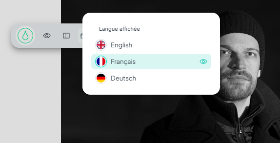
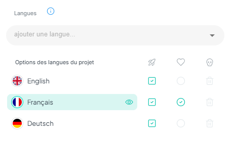

> **Version** : 0.11.18

# Implémentation du multilingue pour les architectes dans le code HTML.

## Le menu de choix de langue

### Enregistrer les préférences utilisateur

Quand l'utilisateur change de langue volontairement alors il est conseillé d'enregistrer sa préférence afin que le site sache le rediriger vers cette langue ultérieurement. On stocke la langue préférée de l'utilisateur dans le local storage "`chosen-lang`".   
Ainsi on aura selon les cas `chosen-lang="fr"` ou par exemple `chosen-lang="it".`

# Détection de la langue de l'utilisateur

Plus d'informations sur [la page index dans le cadre de la publication](#index).

# Gestion des langues dans Tilty App

## Le menu de langue dans la barre de navigation

  
Ce menu permet de sélectionner la langue utilisée dans la preview du site.

## Le menu de langue dans les préférences

  
A partir de ce menu vous pouvez:

* Ajouter une langue au projet

* 👀Choisir la langue affichée en preview

* 🚀 Sélectionner quelles langues seront publiées ou non au moment des publications

* ♥️ Choisir la langue par défaut du projet, par exemple quelle langue est affichée quand l'utilisateur va sur [mon-site.com](http://mon-site.com) au lieu d'aller du [mon-site.com/fr](http://mon-site.com/fr) ou [mon-site.com/en](http://mon-site.com/en)

* 🗑️ enfin vous pouvez supprimer une langue

## Le menu de langue dans les champs d'édition.

  
Il permet de choisir quelles langues sont affichées ou non dans la fenêtre d'édition.  
Cette option est utile si vous souhaitez vous focaliser sur une seule langue ou à l'inverse si vous souhaitez avoir toutes les traductions à portée de main.
