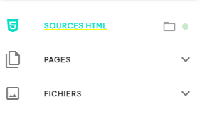
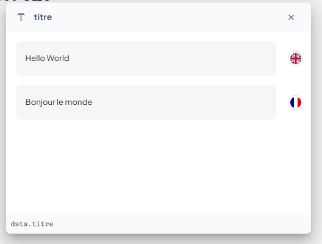
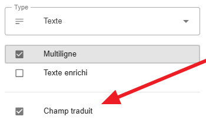
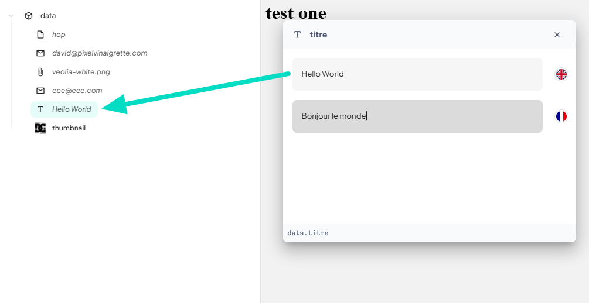
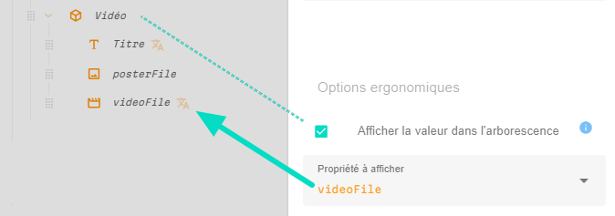
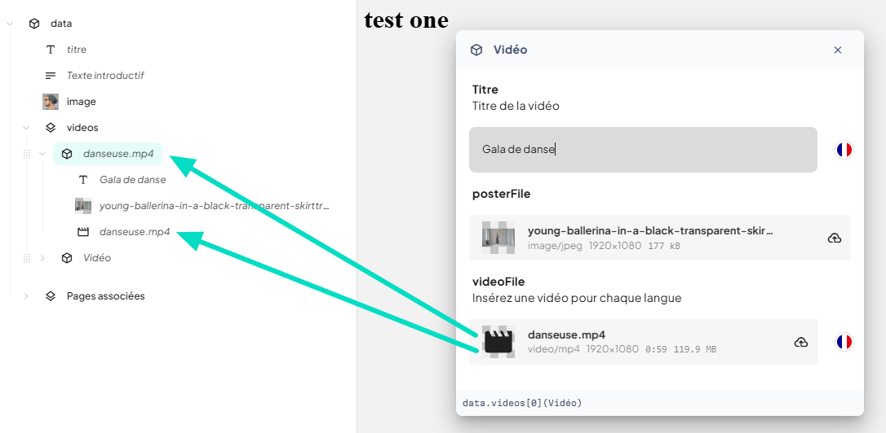

> **Version** : 0.11.15

# 📏 Mode Architecte

#### 

## Les sources HTML 

Cette section de l'application n'est disponible que si vous êtes Architecte.

Cet outil vous permet de gérer les sources statiques de votre projet à savoir les fichiers HTML, CSS, Javascript et autres assets.   
Les pages html qui se trouvent dans cette section serviront de modèles pour générer les pages de votre site.

### Synchronisation des fichiers temps réel

Le workflow de Tilty se fait sans avoir à recourir à un FTP ou a des lignes de commandes.   
Tilty se charge de synchroniser automatiquement les fichiers sources sur votre ordinateur avec le serveur.  
  
Dans la navigation principale une iconographie affiche soit un dossier soit un zip en fonction de ce qui est synchronisé en local

Un point de couleur donne l'état global :  
- rouge si  il n'y a pas de dossier sur le serveur  
- gris si aucun dossier ou zip local n'est synchronisé mais qu'il y a bien des fichiers sur le serveur.  
- orange si des fichiers sont à synchroniser ou si la synchronisation est en cours  
- vert si tout est synchronisé entre votre ordinateur et le serveur.

Un clignotement (ou pas) nous informe sur la synchronisation  
- le clignotement est inexistant si la synchronisation automatique est désactivé  
- le clignotement est lent si la synchronisation automatique est activée et qu'il n'y a rien à synchroniser.  
- le clignotement est rapide si une synchronisation de fichiers est en cours

TODO rédiger

### Travailler avec des sources zippées

Si vous utilisez un builder html tel que webflow, vos sources sont téléchargées sous forme de zip.

TODO impression d'écran export webflow

Afin de vous éviter de dézipper manuellement votre export à chaque fois, Tilty vous offre la possibilité de sélectionner le fichier zip directement. Quand vous remplacerez le fichier zip par un autre (il faut donc qu'il conserve le même nom) le zip sera automatiquement uploadé sur Tilty puis décompressé.

### Certains fichiers sont ignorés

Tilty prend en charge les formats de fichiers statiques.   
Les fichiers `.php, .asp, .htaccess, .sh` etc... sont ignorés.  
Les dossiers tels que `node_modules, .git, .idea` etc qui sont connus pour être des répertoires de sources sont ignorés 

### Ignorer volontairement des fichiers

Si vous souhaitez ne pas synchroniser certains fichiers, faites un click droit dessus et choisissez "ignorer"

TODO rédiger

## Éditer la structure des données dans Tilty.app

### Ajouter, supprimer et réorganiser des champs.

TODO rédiger

### Les différents types de champs

  
Chaque donnée est caractérisée par ce que l'on appelle un type.   
De la même manière que dans une page HTML une balise \ n'a pas le même rôle qu'une balise \<h1\>, un champ "Fichier" dans Tilty n'aura pas la même utilité qu'un champ "Texte". Chaque type présente des caractéristiques différentes.

#### Les champs Texte

TODO rédiger

#### Les champs Nombre

TODO rédiger

#### Les champs Booléens (oui ou non)

TODO rédiger

#### Les champs Lien

TODO rédiger

#### Les champs Fichier

TODO rédiger

#### Les champs Objet

TODO rédiger

#### Les champs Liste (blocks)

TODO rédiger

### Des champs  traduits (ou pas)

#### Textes, nombres, liens, images, vidéos… To translate or not to translate, that is the question.

  

La plupart des types de champs peuvent être traduits dans les différentes langues de votre projet.  
Pour certains champs, comme les champs texte, la question ne se pose pas trop: généralement, ils doivent être traduits à moins qu'ils s'agissent de références produits ou de termes techniques qui sont identiques dans toutes les langues.  
Quand il s'agit de fichiers cela peut dépendre, une vidéo ou un audio peut avoir différentes versions linguistiques tout comme une image si elle contient du texte. Mais vous conviendrez que dans la plupart des cas, les images d'illustration n'ont pas à différer selon si le site est en français ou en anglais.

#### Les objet et les listes ne peuvent être traduits

Les objets sont là pour organiser les données et ils ne sont pas modifiables en soit, Il n'y a pas de sens à traduire des données qui n'existent pas.

Les listes par contre pourraient être traduites, c'est vrai. Selon la langue on pourrait ainsi construire des pages radicalement différentes ou encore des menus de navigation qui diffèrent d'une langue à l'autre . Si cette possibilité est séduisante sur le papier, en pratique elle s'avère complexifier l'édition et devenir ingérable. Un éditeur dans ce cas de figure devrait créer, réorganiser et modifier le contenu de chaque page dans chaque langue. C'est d'ailleurs le choix fait par la plupart des CMS et c'est une des raisons pour laquelle nous avons créé Tilty.

Dans 99% des cas, nous avons constaté qu'une page en anglais ou en français devait conserver la même structure. Quand on rajoute une image ou une section dans une page en anglais, il n'y a pas de raison que la modification ne se reporte pas sur la version française.

### Options ergonomiques

Quand vous éditez  les propriétés d'une donnée, vous pouvez lui conférer des options ergonomiques qui ne vont pas réellement changer son fonctionnement mais vont améliorer son utilisation pour les éditeurs

#### Afficher la valeur dans l'arborescence.

Cette option à utiliser avec parcimonie permet d'afficher dans l'arborescence de données la valeur d'un champ au lieu de son nom. C'est parfois une bonne idée et parfois non, à vous de voir 🙂.   
Si la donnée est traduite, la valeur la plus adéquate sera affichée. Si la donnée n'est pas renseignée, l'option n'aura pas d'effet.   
Enfin, selon le type de donnée, la valeur affichée va différer. Pour un fichier c'est le nom du fichier qui sera affiché alors que pour un lien ce pourra être l'url, le nom de la page ou encore l' adresse email selon le cas.  
**Astuce**: Quand l'option est activée, le champ s'affiche en italique dans l'arborescence de données.

Concernant les Objets, ils n'ont pas de valeur à proprement parler. Si vous souhaitez  rendre leur nom dynamique dans l'arborescence, il vous faudra alors sélectionner un champ enfant qui servira de source.

Dans l'exemple ci-dessous l'objet ***Vidéo*** est configuré pour prendre le nom de son fichier vidéo.  
  

# Titre

## ***Documentation Utilisateur 2025***

# Titre 1

## Titre2

### Titre 3

#### Titre 4
