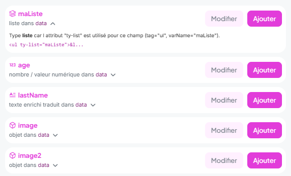
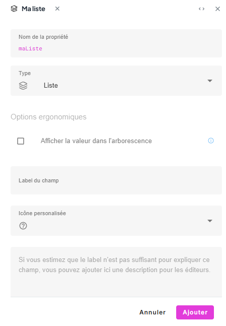

> **Version** : 0.14.0

# Suggestions automatiques de types de champs

Cette fonctionnalité, destinée aux **architectes**, permet à Tilty de *tenter* de déduire le type de champ à créer dans l'app en analysant votre code HTML et vos attributs `ty-*`.

> [!TIP]
> C'est la méthode recommandée pour construire votre structure de données : elle est **beaucoup plus rapide** (environ 10x) que de créer chaque champ manuellement dans l'interface d'administration.

## Fonctionnement général

Lorsque vous intégrez de nouveaux champs dans vos templates HTML sans les avoir créés au préalable, Tilty détecte ces champs manquants.

Dans l'interface d'édition, un **Assistant** (une boîte d'alerte) apparaît pour signaler ces champs manquants.
- Il analyse le contexte (balise HTML, attribut ciblé, nom de la variable).
- Il propose de **créer automatiquement** le champ avec ce qu'il estime être le type le plus approprié.
- Il fournit une explication ("Pourquoi cette suggestion ?") que vous pouvez consulter en dépliant les détails de la suggestion.

Si vous acceptez la suggestion, le champ est créé instantanément dans la structure de données avec la configuration proposée.



### Et si la suggestion ne me convient pas ?

C'est un processus automatique, et il peut arriver que Tilty se trompe ou que vous ayez des besoins spécifiques. Vous gardez la main :

1.  **Modifier le champ avant création :**
    Cliquez sur le bouton **Modifier**. Cela ouvrira l'éditeur de structure pré-rempli avec la suggestion. Vous pourrez alors changer manuellement le type de champ, ses labels, ou ses options avant de le valider.



2.  **Corriger votre code HTML :**
    Si la suggestion est incohérente (par exemple une Liste au lieu d'un Texte), vérifiez s'il n'y a pas d'ambiguïté dans votre code.

```html
<!-- ERREUR : ty-list suggère une Liste -->
<h2 ty-list="titre">Mon Titre</h2>

<!-- CORRECTION : ty-html suggère du Texte -->
<h2 ty-html="titre">Mon Titre</h2>
```

3.  **Ignorer la suggestion :**
    Si vous ne souhaitez pas créer ce champ, n'appuyez tout simplement pas sur "Ajouter".

## Détermination des typologies

Le moteur d'analyse utilise une série d'indices pour *deviner* le type de champ. Ce ne sont pas des règles absolues, mais des heuristiques qui fonctionnent dans la plupart des cas courants et font gagner une temps de développement considérable.

> [!NOTE]
> **Pas d'IA ici ! (ni autre part dans le moteur de Tilty)** Bien que ce comportement puisse paraître "intelligent", il ne fait appel à aucune Intelligence Artificielle. Il s'agit d'un moteur de règles logiques exécuté localement.

### 1. Images avec Redimensionnement (`.resize()`)
Si votre variable est utilisée avec la fonction magique `.resize(w, h)`, elle sera considérée comme une **Image**.
*   *Exemple :* `monImage.resize(800, 600)` → Type **Fichier (Image)**.

### 2. Liste d'objets ou de valeurs (`ty-list`)
La présence de l'attribut `ty-list` indique généralement une **Liste**.
*   *Exemple :* `<div ty-list="mesProjets">` → Type **Liste**.

### 3. Items de Liste (`ty-list-item`)
Le comportement dépend du contenu :
*   **Contenu Riche :** S'il y a d'autres attributs `ty-*` à l'intérieur, c'est probablement un **Objet** complexe.
*   **Contenu Simple :** Si la balise porte elle-même un attribut `ty-*` (ex: `ty-src`), on s'en inspire pour déduire le type (Fichier, Lien, etc.).
*   **Par défaut :** Sans autre indice, cela crée un **Objet** générique, sauf si le nom de la variable évoque clairement du texte.

### 4. Conventions de Nommage
Certains noms de variables orientent fortement la décision vers du **Texte** pour éviter les confusions.
*   **Texte Simple :** `title`, `titre`, `subtitle`, `nom`, `name`, `label`, `btn`, `slug`, `copyright`...
    *   → Type **Texte (Input)**.
*   **Texte Multiligne/Riche :** `description`, `legende`, `intro`, `summary`, `resume`...
    *   → Type **Texte (Multiligne)**, souvent localisé par défaut.

### 5. Objets (`object`)
L'utilisation de la notation par point (parent de propriétés) suggère un **Objet**.
*   *Exemple :* `client.adresse` → `client` est un type **Objet**.
*   *Note :* `ty-scope` pointe aussi souvent vers un objet.

### 6. Fichiers et Médias (`file`)
On devine un fichier selon la balise ou des mots-clés évocateurs.
*   **Balises HTML :** ``, `<video src="...">`, `<audio src="...">`.
*   **Mots-clés :** `image`, `photo`, `logo`, `icon`, `video`, `audio`, `doc`, `pdf`...

### 7. Liens (`link`)
Détecté principalement si on cible `href` sur un lien (`<a>`) ou via des mots-clés comme `link`, `lien`, `url`...

### 8. Numérique (`numeric`)
*   **Calculs :** Utilisation d'opérateurs de comparaison dans un `ty-if`.
*   **Mots-clés :** `nombre`, `number`.

### 9. Booléen (`bool`)
Souvent détecté dans les conditions `ty-if` avec des mots-clés comme `bool`, `check`, `active`, `actif`.

### 10. Pages (`page`)
Si le nom contient "page" sans autre indice contradictoire (comme un attribut src).

### 11. Texte par défaut (`text`)
Si aucune règle ne matche, on se rabat sur du **Texte**.
*   **Éditeur HTML :** Si le contenu par défaut contient des balises ou si le contexte (balise `div`, `article`...) suggère du contenu riche.
*   **Input Simple :** Dans les autres cas.
