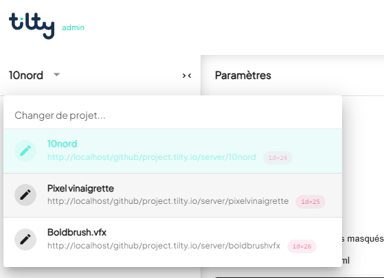
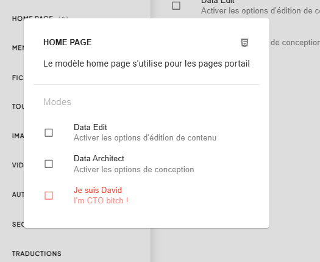

> **Version** : 0.12.0

# Tilty.app

# Tilty  ***Documentation Utilisateur 2025***

# Présentation de l'Admin

L'admin est l'application qui vous permet de concevoir et d'éditer vos projets.  
Vous pouvez passer d'un projet à l'autre en utilisant le menu en haut à gauche.  

## Les différents modes

Tout système d'information n'est autre que du contenu dans un contenant. Chez Tilty, le contenant est conçu par les architectes, le contenu est créé par les éditeurs. Les architectes créent les outils qui seront utilisés par les éditeurs. Les éditeurs créent le contenu qui sera consulté par les lecteurs.  
Vous pouvez définir le rôle d'un utilisateur depuis le dashboard.

### Éditeur

Le mode éditeur désigne toutes les actions permettant de modifier le contenu du projet. Il peut s'agir de créer ou supprimer des pages, modifier des textes, des images, des vidéos etc…  
[Documentation du mode Éditeur](https://docs.google.com/document/d/1iJYjzUuINd9hJ0GS-NUB-CIZAmdVbSSDA6E12ZBUH7Q/edit?pli=1&tab=t.web0yocauhvt) 

### Architecte

Le mode architecte permet de modifier la structure du projet. Seuls les architectes pourront modifier les templates HTML du projet ou encore définir si un champ texte est traduit ou non. 

[Documentation du mode Architecte](https://docs.google.com/document/d/1iJYjzUuINd9hJ0GS-NUB-CIZAmdVbSSDA6E12ZBUH7Q/edit?pli=1&tab=t.i4io6ne3twni)

### Désactiver un mode

Quand la phase de création d'un projet est terminée, les options *architecte* n'ont plus trop de raison d'être. Vous pouvez à ce moment là désactiver les outils de conception et vous concentrer sur l'édition de contenu exactement comme si vous étiez un simple éditeur.

Vous pouvez activer et désactiver les deux modes depuis les paramètres ou depuis la plupart des menus contextuels.

## Les versions

Tilty gère les versions de votre projet de manière transparente, vous permettant de travailler sur des brouillons avant de publier vos modifications.

## Les paramètres {#les-paramètres}

### Fenêtres et navigation
Vous pouvez personnaliser les raccourcis visibles dans la barre de navigation principale. Cela vous permet de garder à portée de clic les outils que vous utilisez le plus souvent et de masquer les autres.

*   **Configuration** : Dans les paramètres, accédez à **Préférences personnelles > Fenêtres**.
*   **Visibilité** : Cochez ou décochez les outils (Pages, Édition, Médias, Assistant, etc.) pour les afficher ou les masquer.
*   **Accès rapide** : Faites un **clic droit** sur n'importe quel bouton de la barre de navigation pour ouvrir le menu de configuration. Les changements sont instantanés et la barre se redimensionne au besoin.

> [!TIP]
> Le menu "**...**" (Plus) affiche toujours la liste complète des fenêtres disponibles, même celles que vous avez choisi de masquer dans la barre principale.
