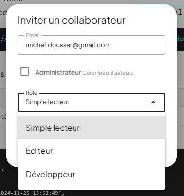

> **Version** : 0.11.10

# Dashboard.tilty.io

# Tilty  ***Documentation Utilisateur 2025***

# Présentation du Dashboard

## Les rôles utilisateurs {#les-rôles-utilisateurs}

Pour chaque projet, vous pouvez inviter plusieurs collaborateurs à participer.  
Selon le rôle que vous leur attribuerez, les utilisateurs n'auront pas les mêmes possibilités.

| Droits                                           | Reader | Editor | Architect |
|:-------------------------------------------------|:------:|:------:|:---------:|
| Accéder aux contenus privés                      |   x    |   x    |     x     |
| Accéder aux contenus non publiés                 |   x    |   x    |     x     |
| Créer des page                                   |        |   x    |     x     |
| Modifier des pages                               |        |   x    |     x     |
| Supprimer des pages                              |        |   x    |     x     |
| Modifier des photos, vidéos etc…                 |        |   x    |     x     |
| Changer la structure  HTML                       |        |        |     x     |
| Créer de nouveaux types de pages                 |        |        |     x     |
| Modifier les options d'édition                   |        |        |     x     |
| Gérer les permissions (CRUD) sur un type de page |        |        |     x     |
| **SEO**                                          |        |        |           |
| Définir la page index                            |        |        |     x     |
| Définir la page 404                              |        |        |     x     |
|                                                  |        |        |           |
|                                                  |        |        |           |
|                                                  |        |        |           |
