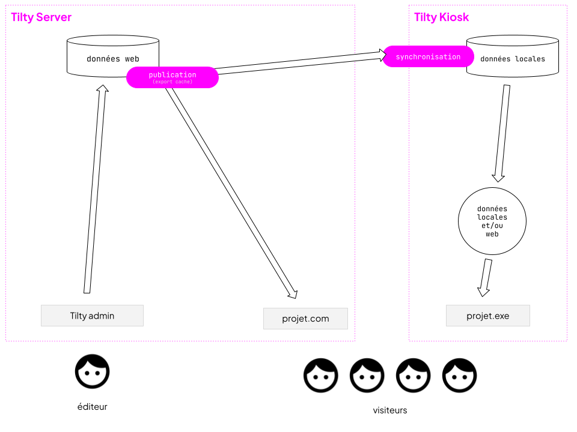
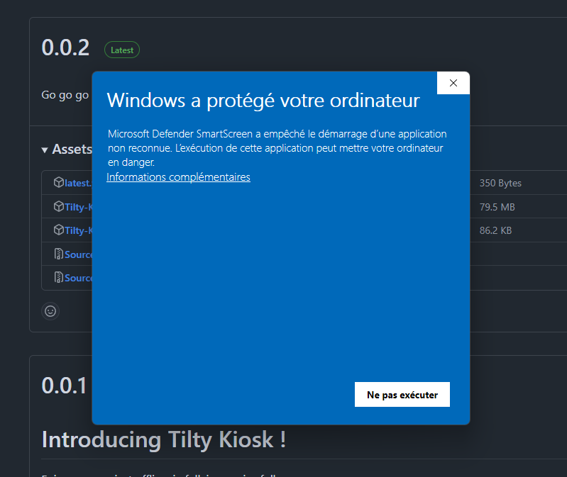
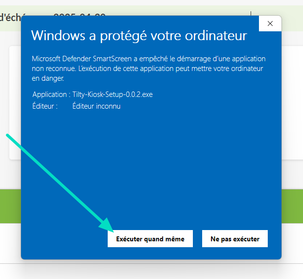

> **Version** : 0.11.9

# Présentation

Tilty kiosk est un exécutable qui fonctionne sous Windows et qui permet d'installer un projet Tilty en tant que programme. Ce mode d'utilisation a été imaginé pour fonctionner dans des musées et tout lieu souhaitant offrir à ses visiteurs une borne d'information multimédia. Le projet Tilty est alors joué en plein écran et ne nécessite pas de connexion internet pour fonctionner.

## Installation

Téléchargez et installez la dernière version de Tilty Kios ici :
 [https://github.com/Tilty-io/tilty-kiosk](https://github.com/Tilty-io/tilty-kiosk)

Lors du premier démarrage de Tilty Kiosk, il vous sera demandé de  ~~vous identifier~~ saisir l'url de votre projet Tilty afin de choisir quel projet diffuser dans le programme.

## Mise à jour du projet

Au démarrage de l'application Tilty kiosk et tout particulièrement lors de la première utilisation, on  va vous proposer de mettre à jour le contenu du programme.
Cette mise à jour va télécharger le dernier export de votre projet;  les fichiers images, vidéos, traductions et autres médias ainsi que les fichiers HTML, javascript, CSS , etc relatifs au projet.

Sans réaliser cette mise à jour, toutes les modifications que vous apporterez à votre projet seront invisibles.
Selon le poids du projet et selon la vitesse de votre connexion internet ça peut être plus ou moins long… mais souvent plus que moins.

## Fonctionnement offline

Tilty ayant téléchargé tous les médias, votre projet devrait pouvoir fonctionner hors ligne.

**`Notes pour les architectes`**
Tous les liens générés par les tilty attributes fonctionneront correctement on/offline.
Par contre, il conviendra de ne pas utiliser de lien  http ou d'API nécessitant une connexion réseau dans le code source si vous souhaitez que Tilty kiosk puisse fonctionner sans connexion internet.
Pensez aux polices de caractères, aux statistiques google analytics, aux CDNs…

## Full screen

Tilty kiosk fonctionne en plein écran.
Vous pouvez paramétrer un minuteur qui ouvre le plein écran automatiquement au démarrage du programme.

## Raccourcis clavier

| Entrer / sortir du fullscreen | `F11` |
| :---- | :---- |
| Sortir du fullscreen | **`ESC`** |
| Quitter le programme | **`ALT`**`+F4` |
| Ouvrir / fermer  les outils de développement | **`F12`** |

Sans clavier, vous ne pourrez pas sortir du programme.

# Limites et bugs connus

## Un seul Tilty kiosk par ordinateur

Vous ne pouvez installer qu'un seul Tilty kiosk par machine

## Alerte de sécurité

Lors de l'installation, Windows peut afficher un message de sécurité indiquant que l'éditeur est inconnu.

 Cela arrive car l'application n'est pas encore certifiée par Microsoft.
 Pour continuer :

* Cliquez sur **"Informations complémentaires"**
* Puis sur **"Exécuter quand même"**

****

