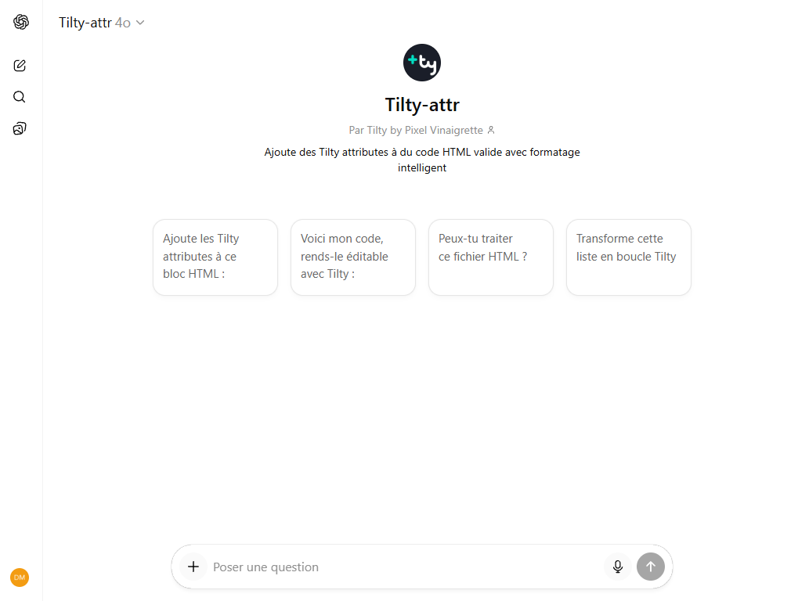

> **Version** : 0.14.0

# Intégration avec les Agents IA

> [!NOTE]
> **Vision Prospective**
> Ce document décrit la vision à long terme de la **collaboration entre Tilty et les Agents IA**. Bien qu'il soit rédigé au présent pour des raisons de fluidité, certaines fonctionnalités ou comportements décrits ici reflètent ce que l'écosystème Tilty **deviendra** dans les mois à venir, et non nécessairement son état actuel.

Autant le dire d'emblée et une fois pour toutes : **non, Tilty n'est pas et ne sera jamais une IA**. Fidèle à sa philosophie frugale, il n'embarque aucun réseau de neurones, ne rêve pas de moutons électriques et ne tentera pas de dominer le monde.

Tilty reste un système **léger, simple et autonome**. Son génie réside ailleurs : il fournit une structure sémantique tellement claire que les Agents IA (ChatGPT, Claude, etc.) peuvent la comprendre et la manipuler avec une efficacité redoutable. **Tilty n'est pas l'intelligence, il est un terrain de jeu idéal pour l'intelligence.**

Enfin, clarifions une chose : Tilty ne se réclame pas de ces *"outils magiques"* où il suffit de prompter *"Fabrique-moi un site"* pour obtenir un résultat qui fonctionne "comme par magie" (tant que vous ne touchez à rien 😅). Tilty s'adresse à un **public de professionnels** qui exigent un contrôle total sur leur code source. Nous sommes ici à l'exact opposé du *Vibe Coding* : avec Tilty, l'humain reste le pilote, l'IA n'est que le copilote qui gère les tâches répétitives.

C'est pourquoi Tilty est **foncièrement agnostique**. Nous ne voulons pas vous enfermer dans un écosystème d'IA propriétaire. Que vous utilisiez ChatGPT, Claude, Mistral ou un modèle local open-source tournant sur votre machine, Tilty reste simplement du HTML bien structuré couplé à un CMS très typé. **Vous êtes libre de choisir votre intelligence.**

## Domaines d'intervention

On distingue deux grands cas d'usage où l'IA peut assister le créateur Tilty :

1.  **La Création ("Tiltyfication")** : Transformer du HTML statique en modèles Tilty.
2.  **L'Édition (Contenu et Sémantique)** : Générer, traduire ou optimiser le contenu.

Pour réaliser ces tâches, l'IA s'appuie sur un ensemble d'outils et de contextes (Documentation, Assistants de code, API) qui servent de **pont** entre votre intention et le système Tilty.

---

## 1. Création : La "Tiltyfication"

Le domaine où les agents IA excellent avec Tilty est la **Tiltyfication** : l'action de transformer une page HTML statique en un modèle dynamique géré par Tilty.

### Pourquoi ça marche ?
Contrairement à d'autres CMS qui nécessitent d'apprendre des syntaxes complexes ou des structures de fichiers propriétaires, Tilty utilise de simples attributs HTML (`ty-*`). 

Un agent IA peut analyser une maquette HTML existante et y ajouter les attributs nécessaires pour :
1. **Identifier les zones éditables** (`ty-html`).
2. **Détecter les listes répétitives** (`ty-list`).
3. **Mapper les sources d'images** (`ty-src`).
4. **etc...**

### Exemple de transformation automatique

Imaginez que vous donniez ce code HTML à une IA :

```html
<article>
  <h1>Pourquoi les chats dominent le monde</h1>
  <div class="content">
    <p>Une étude sérieuse sur leur <strong>complot</strong> mondial.</p>
  </div>
</article>
```

L'IA est capable de comprendre le rôle de ces éléments et de les "Tiltyfier" automatiquement :

```html
<article>
  <h1 ty-text="title">Pourquoi les chats dominent le monde</h1>
  <div class="content" ty-html="articleBody">
    <p>Une étude sérieuse sur leur <strong>complot</strong> mondial.</p>
  </div>
</article>
```

Dans cet exemple, l'agent a pris plusieurs décisions logiques :
- **Choix du type de champ** : 
    - Pour le `h1`, elle choisit **`ty-text`** car c'est un titre (texte brut).
    - Pour la `div.content`, elle choisit **`ty-html`** car elle détecte des balises HTML (`<p>`, `<strong>`) à l'intérieur, indiquant un besoin d'éditeur riche (WYSIWYG).
- **Nommage sémantique** : Elle nomme les variables `title` et `articleBody` en se basant sur la structure HTML.
- **Traduction** : Elle identifie que ces contenus sont du texte naturel destiné aux visiteurs, donc des variables localisables.

> **Référence** : [01-ty-text-et-ty-html.md](02-tilty-attributes/01-ty-text-et-ty-html.md)

### Pourquoi un simple algorithme ne suffirait pas ?
On pourrait penser qu'un simple script ou une Regex pourrait faire ce travail. C'est faux.
Un algorithme classique ne voit que des balises : il ne comprend pas le **sens**. Il ne sait pas distinguer une phrase sarcastique sur des chats (qui nécessite peut-être un traitement spécial) d'un titre juridique.

C'est ici que la magie opère : **la rigueur de Tilty canalise l'imagination de l'IA**.
- **L'IA** apporte la compréhension sémantique : "Ceci ressemble à une liste de fonctionnalités", "Cette image est purement décorative".
- **Tilty** offre le cadre strict (`ty-list`, `ty-src`) pour transformer cette intuition en code robuste et fonctionnel.
Ce duo de choc permet de lier la souplesse de l'intelligence artificielle à la fiabilité d'une structure d'ingénierie.

### Autres exemples de déductions

Voici comment une IA peut interpréter d'autres éléments HTML courants :

#### 1. Une image
**Avant (Statique)**
```html

```
**Après (Tiltyfié)**
```html

```
> **Déduction IA** : 
> - **Variables** : Elle crée `catPhoto` et `catPhotoAlt`.
> - **Optimisation** : Elle détecte des dimensions fixées (`800x600`). Elle applique `.resize(800,600,'cover')` pour garantir que l'image générée remplisse exactement cette zone (mode `cover`) sans déformation, quelle que soit la taille de l'image originale uploadée.
>
> **Référence** : [08-ty-attr-images.md](02-tilty-attributes/08-ty-attr-images.md)

#### 2. Une liste répétitive
**Avant (Statique)**
```html
<ul class="features">
  <li>Café illimité</li>
  <li>Siestes obligatoires</li>
  <li>Licornes fournies</li>
</ul>
```
**Après (Tiltyfié)**
```html
<ul class="features" ty-list="featuresList">
  <li ty-list-item="feature" ty-text="description">Café illimité</li>
  <li ty-list-item="ignore">Siestes obligatoires</li>
  <li ty-list-item="ignore">Licornes fournies</li>
</ul>
```
> **Déduction IA** : 
> 1. **Repérage de modèle** : L'IA identifie que les éléments `<li>` partagent la même structure. Elle définit le premier comme modèle (`ty-list-item="feature"`).
> 2. **Traduction** : Elle détecte que le contenu "Café illimité" est du texte utilisateur et configure la variable `description` comme **traduite**.
> 3. **Nettoyage intelligent** : Elle comprend que les items suivants ("Siestes obligatoires", "Licornes fournies") ne sont que des exemples visuels. Plutôt que de les supprimer, elle leur applique `ty-list-item="ignore"` pour préserver l'aspect de la maquette originale sans polluer les données Tilty.
>
> **Référence** : [02-ty-list.md](02-tilty-attributes/02-ty-list.md)

#### 3. Une vidéo avec sous-titres
**Avant (Statique)**
```html
<video controls>
  <source src="demo.mp4" type="video/mp4">
  <track src="subs_fr.vtt" kind="subtitles" srclang="fr" label="Français">
</video>
```
**Après (Tiltyfié)**
```html
<video controls>
  <source ty-src="demoClip" src="demo.mp4" type="video/mp4">
  <track ty-src="subsFr" src="subs_fr.vtt" kind="subtitles" srclang="fr" label="Français">
  <track ty-src="subsEn" src="subs_en.vtt" kind="subtitles" srclang="en" label="English">
  <track ty-src="subsEs" src="subs_es.vtt" kind="subtitles" srclang="es" label="Español">
</video>
```
> **Déduction IA** : L'IA comprend que la présence de sous-titres implique la possibilité, voire la volonté de traduire ces contenus. Elle prend l'initiative de générer des pistes pour chaque langue du projet, créant des variables `ty-src` dédiées pour permettre une gestion indépendante des fichiers `.vtt`.

**Nuance :** Si l'IA détecte une structure répétable potentielle (même s'il n'y a qu'un seul élément au départ), elle peut choisir de créer une **liste** pour plus de flexibilité.

*Exemple avec une seule piste au départ :*
```html
<video controls src="demo.mp4">
  <track src="subs_fr.vtt" srclang="fr" label="Français">
</video>
```

*Résultat "Liste" anticipé par l'IA :*
```html
<video controls ty-src="videoClip" ty-list="subtitlesList">
   <track ty-list-item="subtitleTrack" ty-src="file" ty-attr="srclang:lang;label:label">
</video>
```
> **Déduction IA** : Plutôt que de créer une variable unique par langue, l'IA anticipe que vous voudrez peut-être ajouter N langues. Elle place `ty-list` sur le conteneur parent (`<video>`) et définit un modèle d'item (`ty-list-item`) sur la balise `<track>`, rendant l'ajout de nouvelles langues infini et administrable. `ty-attr` permet de mapper les attributs spécifiques (`srclang`, `label`).
>
> **Références** : [03-ty-attr-syntaxe.md](02-tilty-attributes/03-ty-attr-syntaxe.md) (pour `ty-attr`) et [02-ty-list.md](02-tilty-attributes/02-ty-list.md)

#### 4. Une liste polymorphe (Page Builders)
C'est le cas le plus impressionnant. Imaginez une "landing page" composée de sections très différentes.

**Avant (Statique)**
```html
<main>
  <!-- Un bloc Hero -->
  <section class="hero">
     <h1>L'application qui fait le café</h1>
  </section>
  
  <!-- Un bloc Features -->
  <section class="features">
     <h2>Pourquoi on est géniaux</h2>
  </section>

  <!-- Un bloc Média + Texte -->
  <section class="media-text">
     
     <p>Regardez cette loutre, elle est incroyable.</p>
  </section>

  <!-- Un bloc Call to Action -->
  <section class="cta">
     <a href="/buy">Prendre mon argent</a>
  </section>
</main>
```

**Après (Tiltyfié)**
```html
<main ty-list="sections">
  <!-- Template pour le Hero -->
  <section class="hero" ty-list-item="heroBlock">
     <h1 ty-text="title">L'application qui fait le café</h1>
  </section>
  
  <!-- Template pour les Features -->
  <section class="features" ty-list-item="featuresBlock">
     <h2 ty-text="title">Pourquoi on est géniaux</h2>
  </section>

  <!-- Template Média + Texte -->
  <section class="media-text" ty-list-item="mediaTextBlock">
     
     <p ty-html="content">Regardez cette loutre, elle est incroyable.</p>
  </section>

  <!-- Template pour le CTA -->
  <section class="cta" ty-list-item="ctaBlock">
     <a ty-href="link" ty-text="label">Prendre mon argent</a>
  </section>
</main>
```
> **Déduction IA** : L'IA identifie une structure de type "Page Builder" où des sections hétérogènes se succèdent. Elle choisit de tout regrouper dans une seule liste `sections`, mais définit **plusieurs templates** (`ty-list-item="heroBlock"`, `featuresBlock`, `mediaTextBlock`, `ctaBlock`). Cela permet à l'utilisateur final d'ajouter et de réordonner ces blocs à volonté, tout en mélangeant les types de contenu.
>
> **Référence** : [06-ty-attr-boucles.md](02-tilty-attributes/06-ty-attr-boucles.md)


### Assistant Tilty Attr GPT (Work in progress)
Un assistant GPT spécialisé est en cours de développement pour faciliter cette tâche :
[Tilty Attr Assistant](https://chatgpt.com/g/g-67e0e94380d08191ad8c18edaa2ba981-tilty-attr)

Cet agent connaît la grammaire des attributs `ty-*` et peut vous aider à préparer vos fichiers HTML ou à résoudre des problèmes de syntaxe complexes.




## 2. Édition : Contenu et Sémantique

### Pourquoi les IA aiment Tilty ?
La force de Tilty réside dans l'utilisation des attributs `ty-*`. Ces attributs ne sont pas seulement des instructions techniques ; ils agissent comme des **métadonnées sémantiques précises** (un peu comme des micro-données `itemprop`) qui aident une IA à comprendre la structure et l'intention de votre contenu.

Au-delà de ces attributs, les données Tilty sont organisées dans une **architecture structurée** (un arbre de données). Chaque champ est **typé** et **décrit**, offrant à l'IA une carte précise du contenu disponible, bien plus riche qu'une simple liste de variables "à plat".


### Aide à la rédaction
Un agent IA peut être utilisé pour remplir automatiquement les variables Tilty à partir de vos modèles de données.

### Traduction automatisée
Grâce à la gestion native du multilingue, un agent peut traiter vos fichiers de données pour proposer des traductions contextuelles et précises.

---

## Les Outils (Le Pont Technique)

Tout comme les agents GPT, les outils de développement ne sont pas une finalité mais des moyens d'accéder plus efficacement à Tilty. Ils agissent comme un **pont** entre l'utilisateur et la structure du projet.

### 1. Le Contexte (Documentation)
Pour être efficace, une IA a besoin de contexte. Tilty lui en fournit via sa documentation et ses nombreux exemples.

> **Astuce** : Dès que vous commencez à saisir des `ty-attributes` à la main dans vos templates, les outils d'autocomplétion (VS Code, WebStorm), nourris par ce contexte, sauront naturellement vous suggérer d'autres attributs.

La documentation est rédigée au format **Markdown (.md)** et disponible publiquement sur GitHub sur [https://github.com/Tilty-io/docs](https://github.com/Tilty-io/docs). Elle est conçue pour être aussi **lisible par une machine que par un humain**, permettant aux LLM de respecter votre syntaxe précise.

> [!IMPORTANT]
> **Nouveau : Le AI Toolkit** 🚀
> Pour faciliter encore plus la vie des développeurs, Tilty inclut désormais un **AI Toolkit** prêt à l'emploi.
> Situé dans le dossier `client/public/doc/ai-toolkit/` (ou directement à la racine de la documentation si vous l'avez téléchargée), il contient :
> *   `AGENT_CONTEXT.md` : Un fichier "Master" optimisé contenant toute la documentation, les règles strictes et les définitions TypeScript. **C'est le fichier à donner à votre IA.**
> *   `examples.md` : Un dataset d'entraînement "Few-Shot" avec des exemples "Before/After".
> *   `ty-attributes.d.ts` : Les définitions de type officielles pour l'autocomplétion.
>
> 👉 **Conseil Pro** : Si vous utilisez Cursor ou Windsurf, ajoutez simplement le fichier `AGENT_CONTEXT.md` à votre contexte global pour transformer votre IDE en expert Tilty instantané.

### 2. Les Assistants de Code (Copilot, Cursor, Antigravity...)
Les outils de développement modernes (dont l'excellent **Antigravity** propulsé par **Gemini**, qu'on aime beaucoup par ici 😉) offrent une compréhension contextuelle profonde. Ils permettent déjà :
- **L'autocomplétion intelligente** des attributs `ty-*`.
- **La détection d'erreurs** en temps réel.
- **La "Tiltyfication" à la volée** directement dans l'IDE.

### 3. Le Futur Standard : Le protocole MCP
Pour aller plus loin, Tilty adopte le **Model Context Protocol (MCP)**.
Chaque projet Tilty agit comme un "Serveur MCP" qui expose ses données et actions à n'importe quelle IA compatible (Claude, IDEs, etc.), sans bricolage spécifique.

- **Resources (Lecture)** : L'IA lit l'arborescence (`tilty://pages`), la documentation (`tilty://doc`) ou le schéma (`tilty://schema`).
- **Tools (Action)** : L'IA exécute des tâches techniques (création de pages, traduction, relecture, validation syntaxique).
- **Prompts (Guidage)** : Tilty fournit ses propres instructions système ("Respecte les conventions...").

Cela s'aligne avec notre philosophie agnostique : nous exposons un standard ouvert, vous connectez l'intelligence de votre choix.

### 4. L'API (Experimental)
Tilty dispose également d'une API REST (ouverte courant 2027) pour permettre aux agents de lire la structure, proposer des modifications ou s'interfacer avec le workflow de publication.

*Cette API est actuellement en cours de définition et évoluera avec les futures versions. Restez connectés !*
